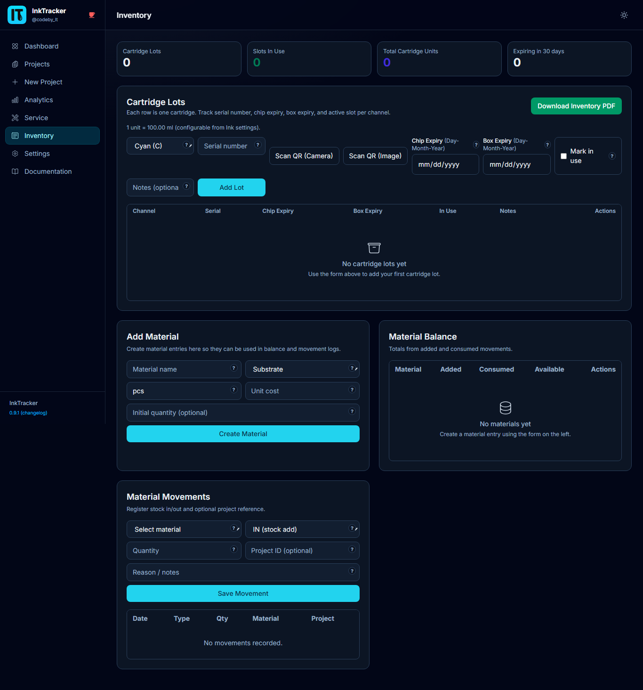
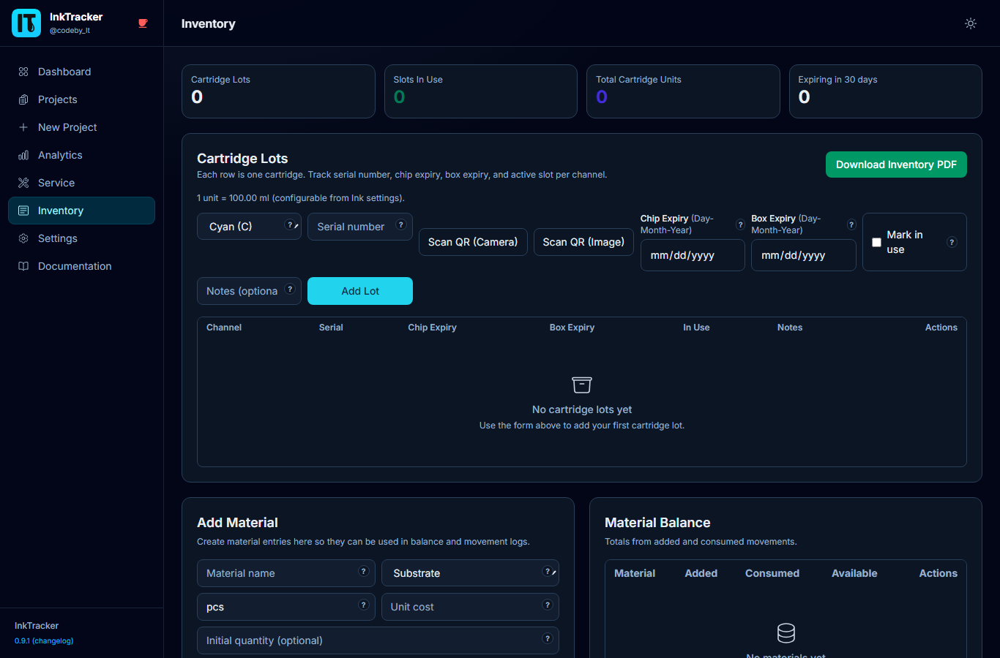

# 6. Inventory

The **Inventory** page tracks what you have on hand: project **materials** and ink
**cartridge stock**. Keeping it current means you never run out mid-job.

---

## Materials
Track your material items and their stock movements:

- **Add an item** — name, category, and cost per unit.
- **Record movements** — log stock coming in or going out to keep counts accurate.

## Cartridge lots
Track sealed cartridges you've bought:

- **Add a lot** — record a batch of cartridges in stock.
- **Mark "in use"** — flag a lot as the one currently installed.
- **Adjust quantity** — update counts as you open or restock.

## Download a report
Click **Report (PDF)** to export a printable stock summary for your records.

💡 **Tip:** Group and filter the materials table to find low items quickly, then top up
before a busy week.

---

Next: **[Analytics →](07-Analytics)**
