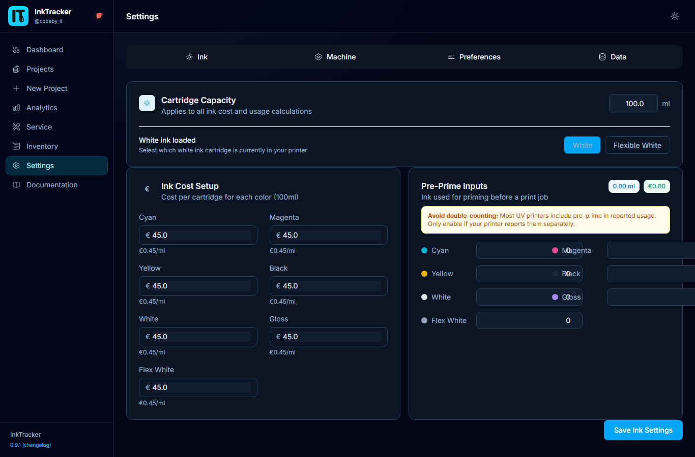

# 8. Settings

**Settings** is where you tell InkTrack about your shop. These values power every
cost and profit calculation, so it's worth setting them up carefully once.

---

## Machine
Enter your printer's **purchase price**, **lifespan**, and **annual hours**. InkTrack
spreads the cost across jobs so each project carries a fair share.

## Ink costs
Set the **price** and **capacity** for each ink color channel. This is how per-job ink
cost is calculated.

| Channel | Color |
|---|---|
| C | Cyan |
| M | Magenta |
| Y | Yellow |
| K | Black |
| W | White |
| GL | Gloss |
| FW | Flex White |

## Labor & overhead
Set your **hourly labor rate** and an **overhead %** to cover rent, power, and other
running costs.

## Margins & currency
Choose your **currency** and the **margin thresholds** that decide the profit badges
(Strong / Target / Minimum / Loss).

## Auto-maintenance sync
Turn on a daily automatic maintenance log and pick the time — keeps ink levels accurate
without manual entry.

## Backup & restore (admin)
Download a **backup** of your data, or **restore** from one. Admins can also **reset**
the database.

⚠️ **Note:** Reset and restore replace your data. Take a backup first.

💡 **Tip:** Update prices whenever ink or material costs change — new projects use the
latest numbers automatically.

---

Next: **[Documentation Links →](09-Documentation-Links)**
