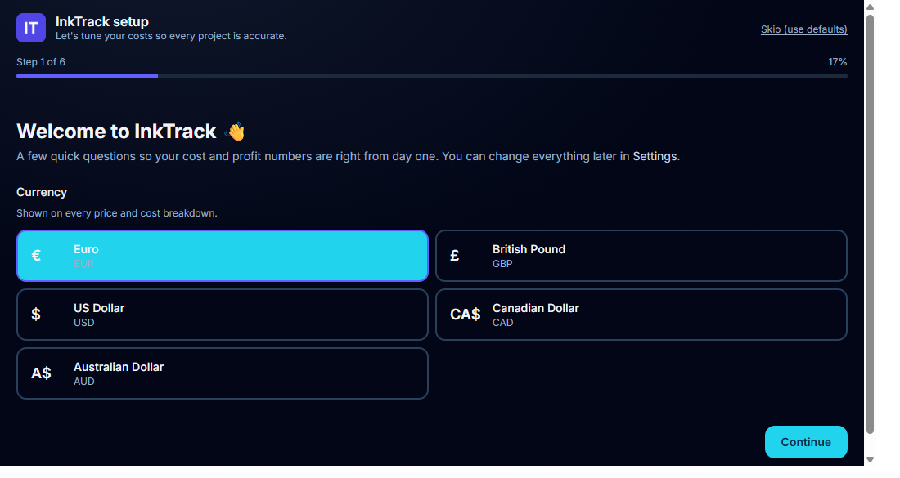

# 1. Getting Started

This guide gets you from zero to your first priced project. It takes about 5 minutes.

---

## Open InkTrack

InkTrack runs in your web browser. Open it at the address your studio uses
(when running locally, that's **http://localhost:8000**). The first time it starts,
it sets itself up automatically with sensible defaults — there's nothing to install
manually.

## Take a quick tour

On a computer, the **left sidebar** is your main menu. On a phone, tap the
**hamburger menu (☰)** at the top, or use the **bottom tab bar** for the most common
areas.

| Menu item | What it's for |
|---|---|
| **Dashboard** | Your shop's health at a glance |
| **Projects** | All your jobs |
| **New Project** | Price a new job |
| **Analytics** | Revenue, profit, and ink trends |
| **Service** | Log cartridge swaps and maintenance |
| **Inventory** | Track materials and cartridge stock |
| **Settings** | Set up your machine, ink, and prices |

## First-run setup (do this once)

The first time you open InkTrack on a fresh install, the **Dashboard** shows a
**"Finish your setup"** banner. Click **Finish setup** to launch the guided setup
wizard, which walks you through the essentials so your cost and profit numbers are
accurate from day one:

1. **Currency** — pick from Euro, British Pound, US Dollar, Canadian Dollar, or
   Australian Dollar. It's shown on every price.
2. **Printer** — choose your model to pre-fill machine and ink defaults. Cartridge
   size, tare weight, and ink price differ between printers.
3. **Machine costs** — purchase price, lifespan, running hours, power, and
   maintenance.
4. **Ink** — price per cartridge (applied to all colour inks and Gloss), cartridge
   capacity, and empty-cartridge (tare) weight.
5. **Labour & margins** *(optional)* — hourly rate, overhead, and profit targets.
6. **Review & finish**.

> ⚠️ **Note:** The built-in defaults are for the **Eufymake E1** printer. If you use
> a different printer, pick **Other / Custom** in the printer step and enter your own
> cartridge capacity, tare weight, and prices.

💡 **Tip:** Prefer to skip the wizard? Click **Dismiss** on the banner and adjust
everything directly in **Settings**. You can re-open the wizard anytime from
**Settings → Preferences → Run setup wizard**. Every new project uses the latest values.

## Create your first project

1. Click **New Project**.
2. Follow the wizard steps (print settings → details → materials → pricing).
3. Click **Save** to see your full cost and profit breakdown.

See the [Creating a Project](03-new-project-wizard.md) guide for the full walkthrough.

## Install it on your phone or desktop (optional)

InkTrack can be installed like a regular app so it opens full-screen from your home
screen and works offline.

| Device | How to install |
|---|---|
| **Android (Chrome)** | Tap the install banner, or **⋮ → Install app** |
| **iPhone (Safari)** | Tap **Share → Add to Home Screen** |
| **Desktop (Chrome/Edge)** | Click the **install icon (⊕)** in the address bar |

⚠️ **Note:** If you lose internet, InkTrack shows an amber "offline" banner. Pages
you've already opened keep working; it reconnects automatically when you're back online.

---

Next: **[The Dashboard →](02-dashboard.md)**
