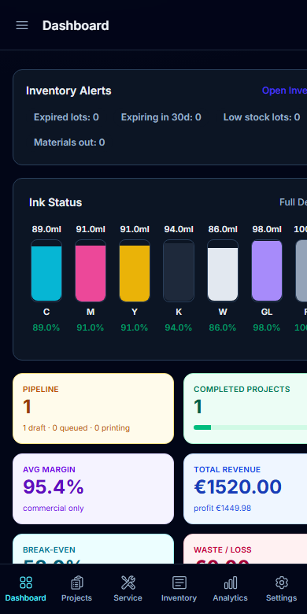
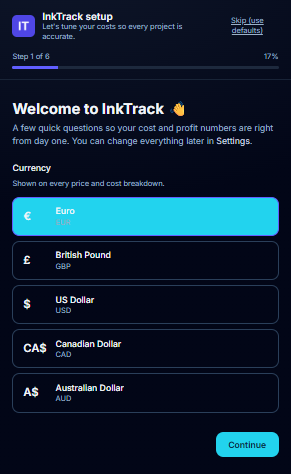
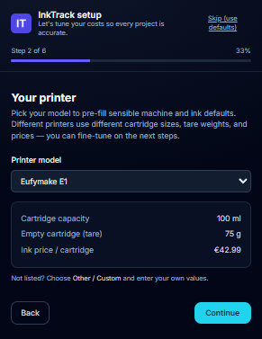
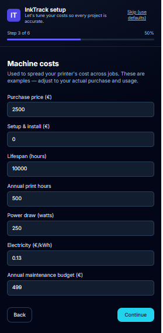
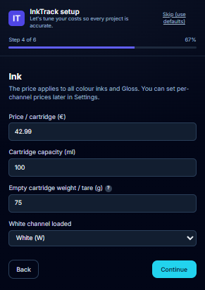
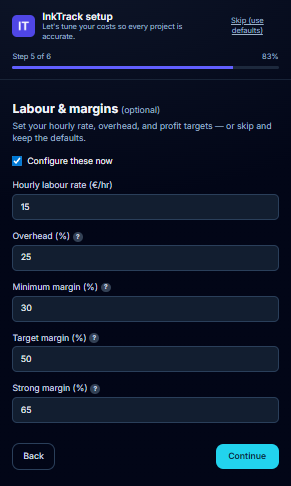
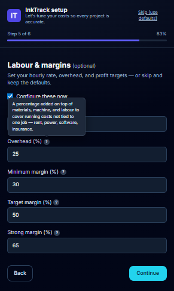
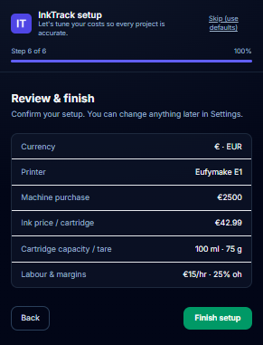

# 1. Getting Started

This guide gets you from zero to your first priced project. It takes about 5 minutes.

---

## Open InkTracker

InkTracker runs in your web browser. Open it at the address your studio uses
(when running locally, that's **http://localhost:8000**). The first time it starts,
it sets itself up automatically with sensible defaults — there's nothing to install
manually.

## Take a quick tour

On a computer, the **left sidebar** is your main menu. On a phone, tap the
**hamburger menu (☰)** at the top, or use the **bottom tab bar** for the most common
areas.

| Menu item | What it's for |
|---|---|
| **Dashboard** | Your shop's health at a glance |
| **Projects** | All your jobs |
| **New Project** | Price a new job |
| **Analytics** | Revenue, profit, and ink trends |
| **Service** | Log cartridge swaps and maintenance |
| **Inventory** | Track materials and cartridge stock |
| **Settings** | Set up your machine, ink, and prices |

## First-run setup (do this once)

The first time you open InkTracker on a fresh install, the **Dashboard** shows a
**"Finish your setup"** banner. Click **Finish setup** to launch the guided setup
wizard, which walks you through the essentials so your cost and profit numbers are
accurate from day one.

The wizard has six quick steps with a progress bar along the top. You can go
**Back** at any point, or **Skip (use defaults)** from the header.

### Step 1 — Currency

Pick from **Euro (€)**, **British Pound (£)**, **US Dollar ($)**, **Canadian
Dollar (CA$)**, or **Australian Dollar (A$)**. Your choice is shown on every price
and cost breakdown.

### Step 2 — Printer

Choose your model to pre-fill machine and ink defaults. Cartridge size, tare
weight, and ink price differ between printers, so this saves you typing.

> ⚠️ **Note:** The built-in defaults are for the **Eufymake E1** printer. If you use
> a different printer, pick **Other / Custom** and enter your own cartridge capacity,
> tare weight, and prices on the next steps.

### Step 3 — Machine costs

Enter your printer's purchase price, setup cost, lifespan, annual running hours,
power draw, electricity rate, and maintenance budget. InkTracker uses these to spread
the machine's cost across every job.

### Step 4 — Ink

Set the price per cartridge (applied to all colour inks and Gloss), cartridge
capacity, and the empty-cartridge (tare) weight used for weight-based ink
estimates. Hover the **?** next to *tare* for a quick explanation.

### Step 5 — Labour & margins *(optional)*

Tick **Configure these now** to set your hourly labour rate, overhead, and profit
targets — or leave it unticked to keep the defaults. The **?** help icons explain
overhead and the margin thresholds.

Hover or tap any **?** to see a plain-language explanation, for example the
overhead help:

### Step 6 — Review & finish

Confirm your setup at a glance, then click **Finish setup**. You land back on the
Dashboard, ready to price your first project.

💡 **Tip:** Prefer to skip the wizard? Click **Dismiss** on the banner and adjust
everything directly in **Settings**. You can re-open the wizard anytime from
**Settings → Preferences → Run setup wizard**. Every new project uses the latest values.

## Create your first project

1. Click **New Project**.
2. Follow the wizard steps (print settings → details → materials → pricing).
3. Click **Save** to see your full cost and profit breakdown.

See the [Creating a Project](03-new-project-wizard.md) guide for the full walkthrough.

## Install it on your phone or desktop (optional)

InkTracker can be installed like a regular app so it opens full-screen from your home
screen and works offline.

| Device | How to install |
|---|---|
| **Android (Chrome)** | Tap the install banner, or **⋮ → Install app** |
| **iPhone (Safari)** | Tap **Share → Add to Home Screen** |
| **Desktop (Chrome/Edge)** | Click the **install icon (⊕)** in the address bar |

⚠️ **Note:** If you lose internet, InkTracker shows an amber "offline" banner. Pages
you've already opened keep working; it reconnects automatically when you're back online.

---

Next: **[The Dashboard →](02-dashboard.md)**
