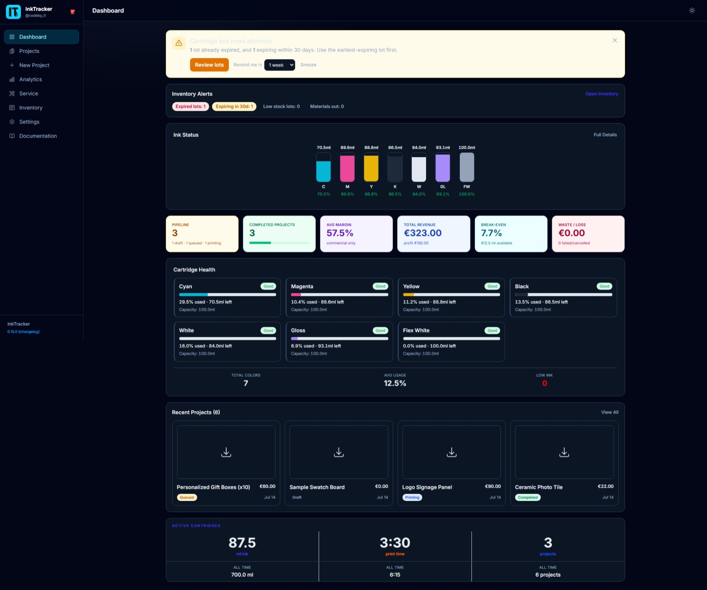
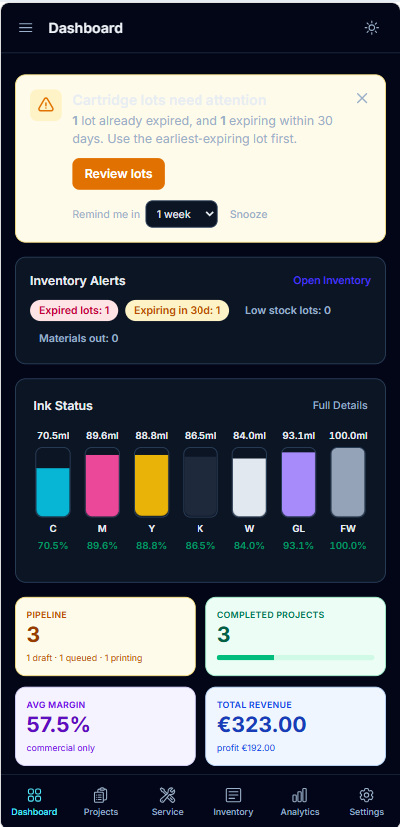
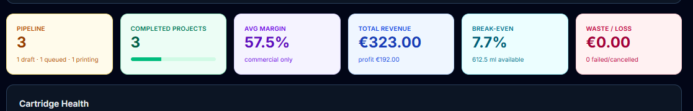
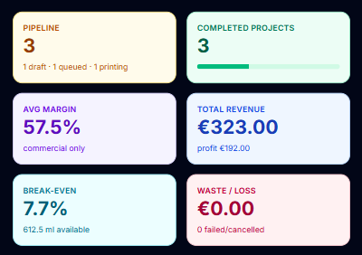
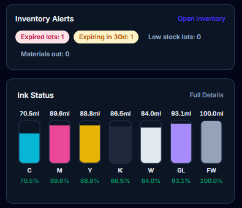

# 2. The Dashboard

The **Dashboard** is your home base. It shows your studio's health in a single glance:
how much ink you have left, how your projects are doing, and where attention is needed.

📱 On mobile

---

## What you'll see

### Ink status strip
A row across the top shows each ink color and how full it is, so you can spot a low
tank before it stops a job.

### KPI cards
Quick numbers that matter — totals like projects, revenue, and profit at a glance.

📱 On mobile

### Cartridge health grid
A color-coded grid of every ink cartridge so low tanks are easy to find.

📱 On mobile

| Color | Meaning |
|---|---|
| 🟢 **Good** | 60% or more remaining |
| 🟡 **Caution** | 20–59% remaining |
| 🔴 **Low** | Under 20% — plan a replacement |

### Recent projects & active cartridge usage
Cards for your latest projects (with their profit badge) and a summary of how much
ink your current cartridges have used.

## Understanding the profit badges

Throughout the app, each project shows a badge based on its profit margin:

| Badge | Margin |
|---|---|
| **Strong** | 50% or higher |
| **Target** | 30–49% |
| **Minimum** | 0–29% |
| **Loss** | Below 0% — you're losing money |

💡 **Tip:** Click any recent-project card to open its full breakdown.

⚠️ **Note:** If a tank shows **Low**, head to [Service](05-service-maintenance.md) to
log a replacement so your ink levels stay accurate.

---

Next: **[Creating a Project →](03-new-project-wizard.md)**
