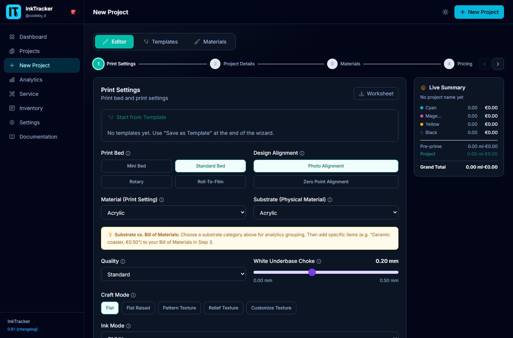
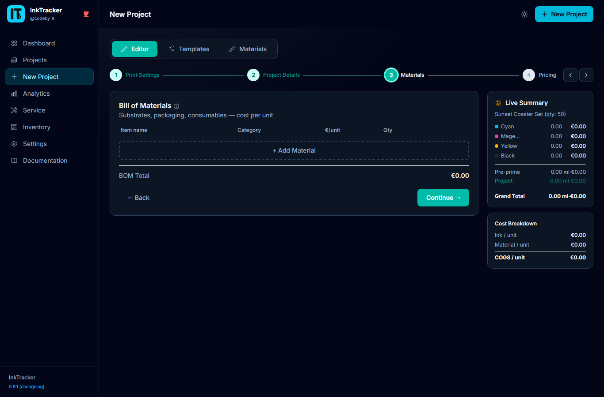
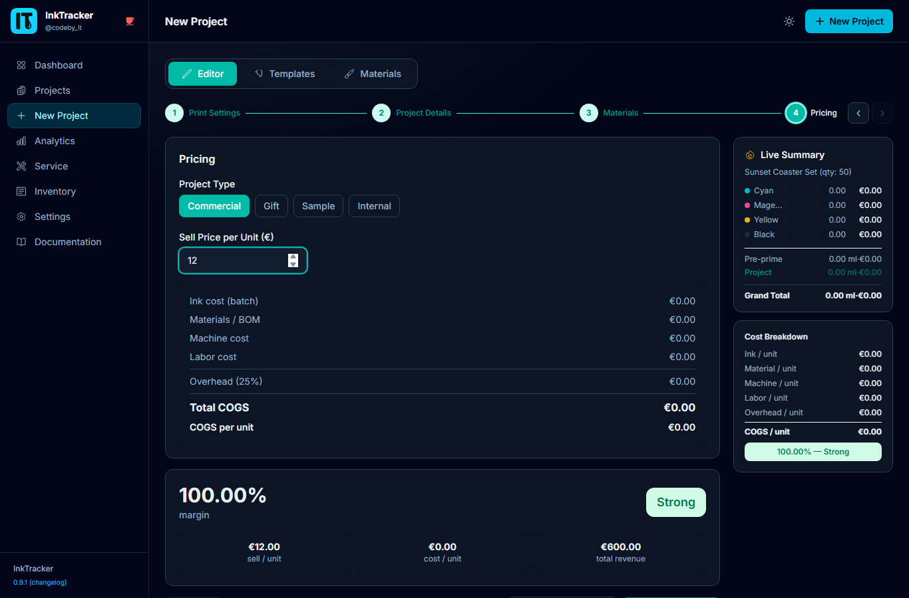
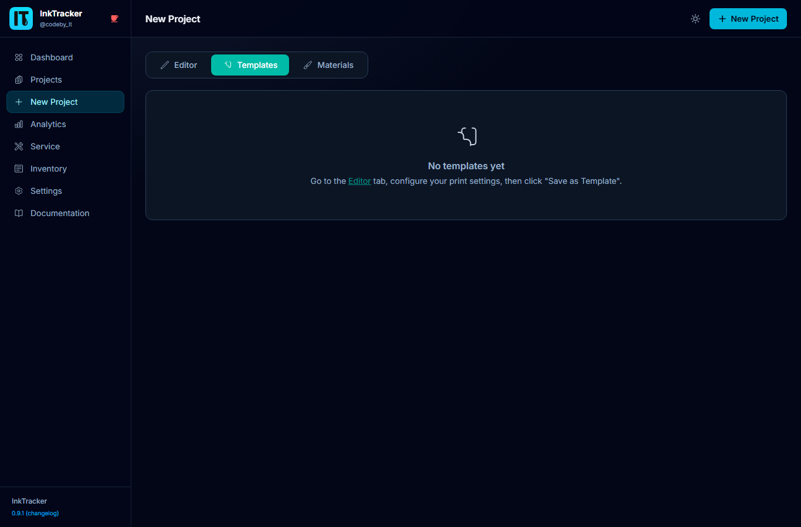

# 3. Creating a Project

The **New Project** wizard walks you through pricing a job from start to finish. By the
end, you'll have a full cost breakdown and a recommended price with a profit margin.

Open it from **New Project** in the menu. The wizard has three tabs across the top:
**Editor**, **Templates**, and **Materials**.

---

## The Editor tab (4 steps)

### Step 1 — Print settings
Choose how the piece is printed: ink mode, alignment, and ink usage per color channel.

💡 **Multiple craft faces:** If your shop has this turned on, you can add more than one
**craft face** to a single project — each with its own print mode and ink usage. Handy
for double-sided or multi-part pieces.

### Step 2 — Details
Enter the **name**, quantity, notes, and any project details.

### Step 3 — Materials (BOM)
Add the materials used (your "bill of materials"). Pick from your **Materials Library**
or type items in. Each line adds its cost to the total.

### Step 4 — Pricing
See the full **COGS breakdown** (ink + materials + machine + labor + overhead), set
your sell price, and watch the **margin badge** update live.

Click **Save** to create the project.

## The Templates tab

Apply a saved **print template** to fill settings instantly, so repeat jobs take
seconds. You can save the current settings as a new template too.

## The Materials tab

Browse and manage your reusable **Materials Library** without leaving the wizard.

## Print a worksheet

After saving, you can print a clean **worksheet** for the shop floor with the job's
settings, ink, and materials.

⚠️ **Note:** Prices come from your **Settings**. If your numbers look off, check ink
costs, labor, and overhead there first.

---

Next: **[Managing Projects →](04-projects.md)**
