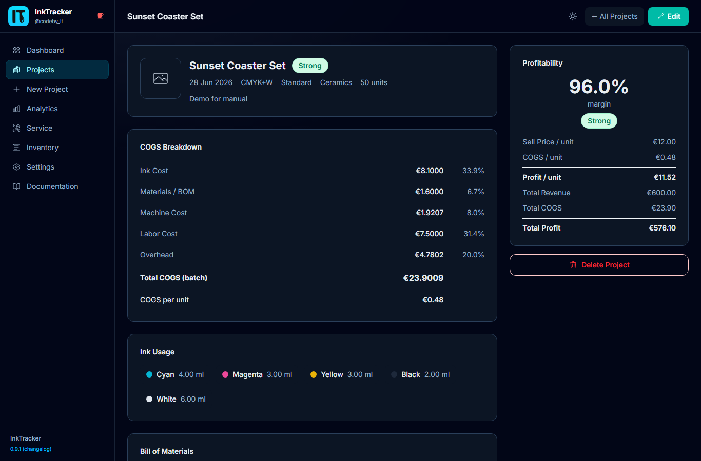

# 4. Managing Projects

The **Projects** page lists every job you've created. From here you can find, open,
edit, and organize your work.

---

## Find a project
Use the **search** and **filters** at the top to narrow by name or status. Click any
project to open its detail page.

## Read the detail page
The project detail page shows the full **COGS breakdown**, materials, ink usage, and a
**profitability summary** with its margin badge.

## Common actions
Open a project, then use the actions menu:

| Action | What it does |
|---|---|
| **Edit** | Reopen the wizard to change settings or pricing |
| **Duplicate** | Copy the project as a starting point for a similar job |
| **Status** | Mark progress (e.g. active, complete) |
| **Archive** | Hide finished jobs from the main list (**Restore** to bring back) |
| **Delete** | Move to trash; **Restore** later, or permanently remove |
| **Export CSV** | Download your projects as a spreadsheet |

💡 **Tip:** Archiving keeps your active list tidy without losing any data.

⚠️ **Note:** Deleting moves a project to trash first, so an accidental delete can be
undone. A **permanent delete** cannot.

---

Next: **[Service & Maintenance →](05-service-maintenance.md)**
