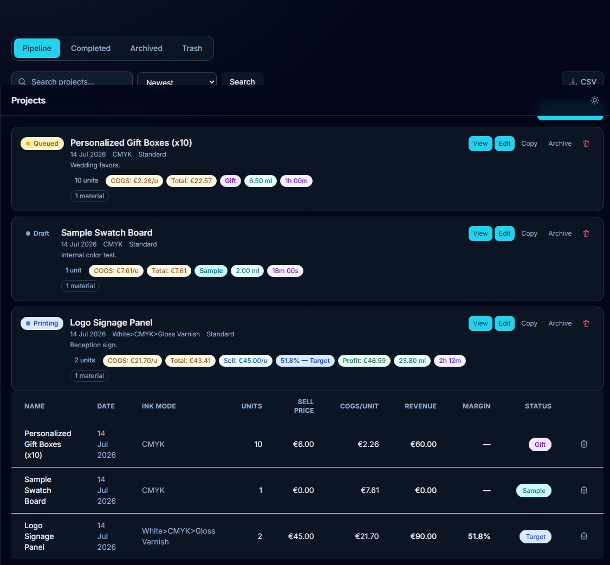
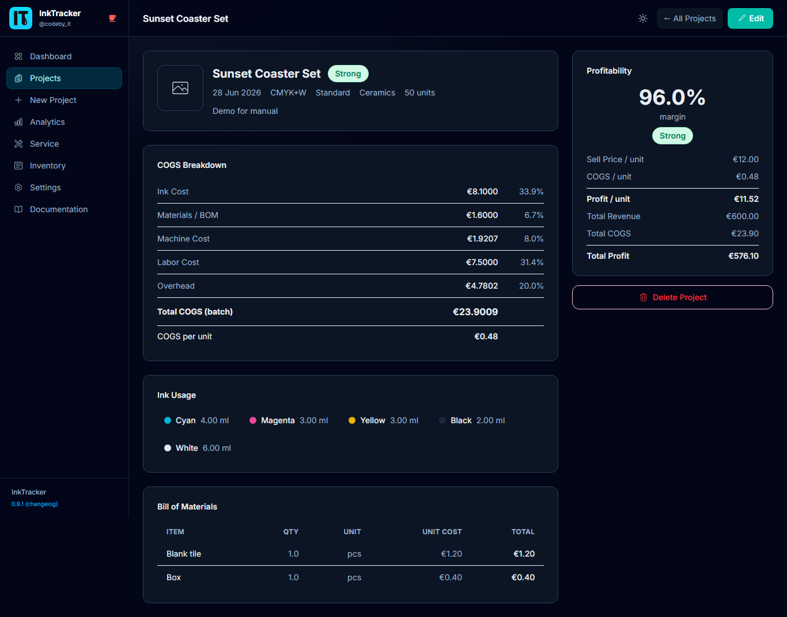
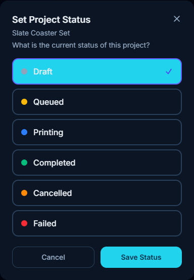
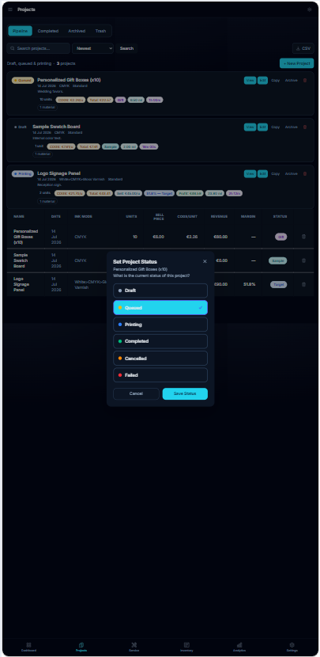

# 4. Managing Projects

The **Projects** page lists every job you've created. From here you can find, open,
edit, and organize your work.

---

## Find a project
Use the **search** and **filters** at the top to narrow by name or status. Click any
project to open its detail page.

## Read the detail page
The project detail page shows the full **COGS breakdown**, materials, ink usage, and a
**profitability summary** with its margin badge.

## Change a project's status
Every project has a **status** - shown as a coloured pill on the Pipeline and Completed
tabs. **Click the status pill** to open the status picker, choose the new status, then
**Save Status**.

📱 On mobile

There are six statuses:

| Status | Where it lives | Meaning |
|---|---|---|
| **Draft** | Pipeline | Still being set up |
| **Queued** | Pipeline | Ready and waiting to print |
| **Printing** | Pipeline | On the machine now |
| **Completed** | Completed | Finished successfully |
| **Cancelled** | Completed | Called off |
| **Failed** | Completed | Didn't print correctly |

**Tip:** To mark a job done, click its status pill and choose **Completed** - it moves
from the **Pipeline** tab to the **Completed** tab automatically.

## Common actions
Open a project, then use the actions menu:

| Action | What it does |
|---|---|
| **Edit** | Reopen the wizard to change settings or pricing |
| **Duplicate** | Copy the project as a starting point for a similar job |
| **Status** | Click the status pill to move a job through Draft -> Completed |
| **Archive** | Hide finished jobs from the main list (**Restore** to bring back) |
| **Delete** | Move to trash; **Restore** later, or permanently remove |
| **Export CSV** | Download your projects as a spreadsheet |

**Tip:** Archiving keeps your active list tidy without losing any data.

**Note:** Deleting moves a project to trash first, so an accidental delete can be
undone. A **permanent delete** cannot.

---

Next: **[Service & Maintenance ->](05-service-maintenance.md)**
