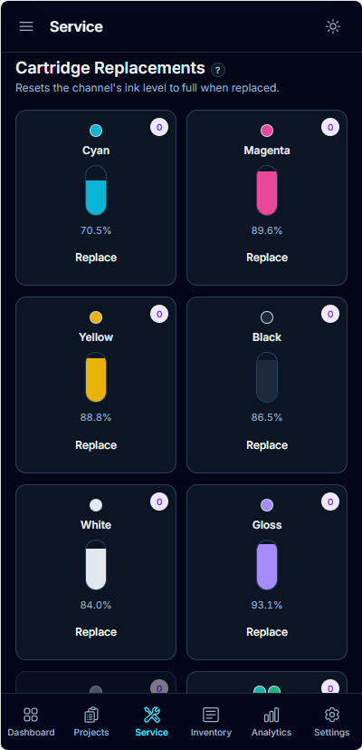
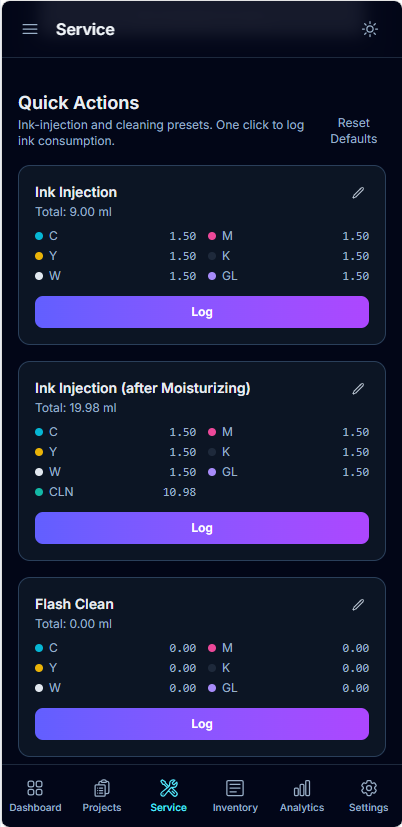
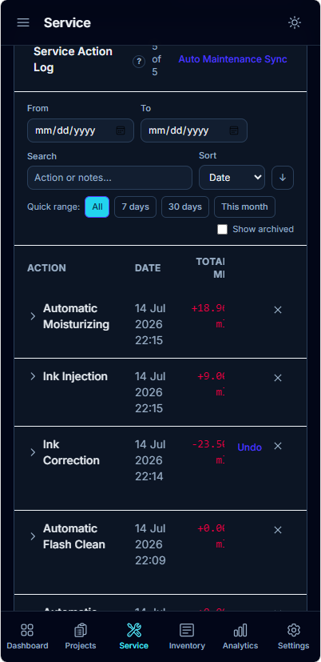

# 5. Service & Maintenance

The **Service** page is where you keep ink levels and machine upkeep accurate. Logging
here keeps your dashboard and costs trustworthy.

---

## Set Current Ink Level
When your tracked ink doesn't match reality, correct it directly — no +/- guesswork:

1. Open **Service**.
2. Under **Set Current Ink Level**, each channel is prefilled with its currently tracked
   remaining ml. Type the **actual remaining ml** for any channel that's off.
3. A live **"→ new value"** badge previews the change per channel, and the **Save** button
   stays disabled ("No changes to save") until something actually differs.
4. Enter a short **reason** and click **Save Ink Levels**.

InkTracker computes the adjustment so the level lands exactly on what you entered, and ink
levels are always capped at **0–100 %** (no surprise jumps). Not sure of the amount? Use the
built-in **weight → remaining ink** helper to estimate ml from a cartridge's weight.

## Log a cartridge replacement
When you swap a tank, record it so the level resets correctly:

1. In the **Cartridge Replacements** grid, find the channel and click **Replace**.
2. Optionally add a note, then confirm.

📱 On mobile

The **Cleaning + Moisturizing Liquid** compartments are shown as a single **UV Cleaning
Cartridge** — one card with both levels, one replacement count, and one **Replace** that
resets both, matching the physical part. InkTracker then calculates remaining ink from this
point forward.

## Quick-action presets
Common jobs (like a head clean) are one-click **presets**. Tap a preset to log it
instantly. You can create, edit, delete, and reset presets to defaults.

📱 On mobile

## Hardware maintenance events
Log bigger upkeep (part replacements, scheduled service) as **hardware events** so you
have a full history.

## Auto-maintenance sync
If turned on (in **Settings → Preferences**), InkTracker automatically logs a daily
maintenance ink amount at a set time, and includes it in cartridge levels.

## Action history & ink corrections
The **Service Action Log** lists everything that's happened, with date / quick-range /
search filters and configurable archive & delete windows. Ink corrections appear as a
**level change** — green when ink was added, red when removed — and you can **expand any row
to see the per-ink breakdown**. Made a mistake? Every correction row has a persistent
**Undo** button that reverts the levels to before it was applied.

📱 On mobile

💡 **Tip:** Log replacements and corrections promptly — accurate ink levels make every
project's cost correct.

---

Next: **[Inventory →](06-inventory.md)**
