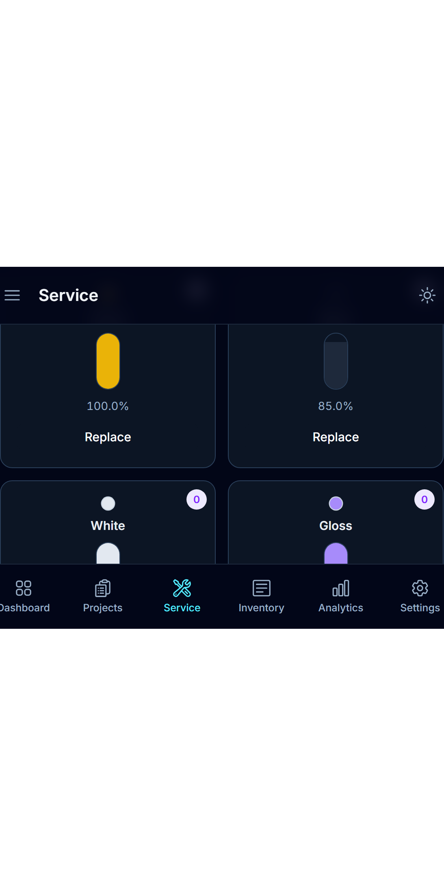
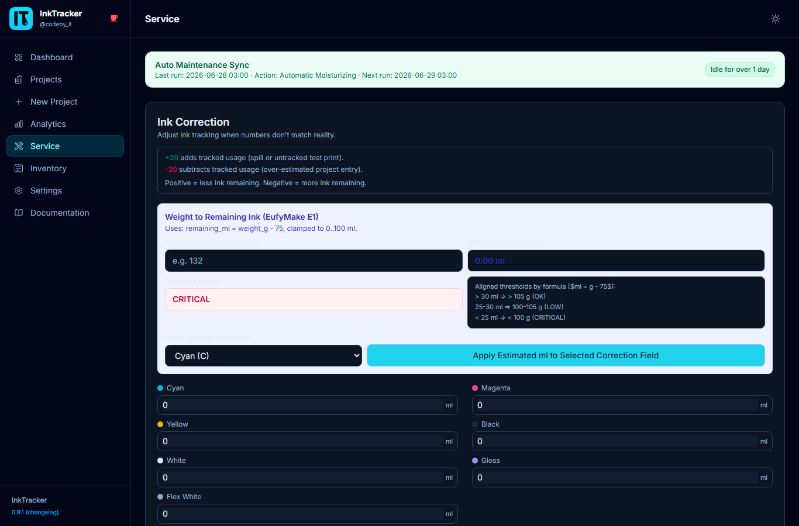
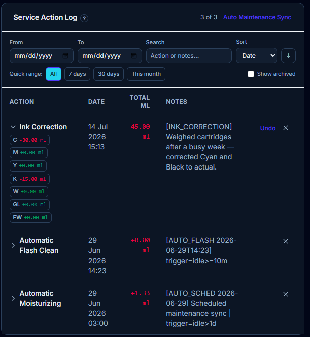

# 5. Service & Maintenance

The **Service** page is where you keep ink levels and machine upkeep accurate. Logging
here keeps your dashboard and costs trustworthy.

---

## Log a cartridge replacement
When you swap a tank, record it so the level resets correctly:

1. Open **Service**.
2. In the cartridge form, choose the **color channel** and enter the new capacity.
3. Click **Save**.

InkTracker then calculates remaining ink from this point forward.

## Quick-action presets
Common jobs (like a head clean) are one-click **presets**. Tap a preset to log it
instantly. You can create, edit, delete, and reset presets to defaults.

## Hardware maintenance events
Log bigger upkeep (part replacements, scheduled service) as **hardware events** so you
have a full history.

## Auto-maintenance sync
If turned on (in **Settings → Preferences**), InkTracker automatically logs a daily
maintenance ink amount at a set time, and includes it in cartridge levels.

## Action history & ink corrections
The **action log** lists everything that's happened. If a level looks wrong, use an
**ink correction** to adjust it — and **undo** it if needed.

💡 **Tip:** Log replacements promptly — accurate ink levels make every project's cost
correct.

---

Next: **[Inventory →](06-inventory.md)**
