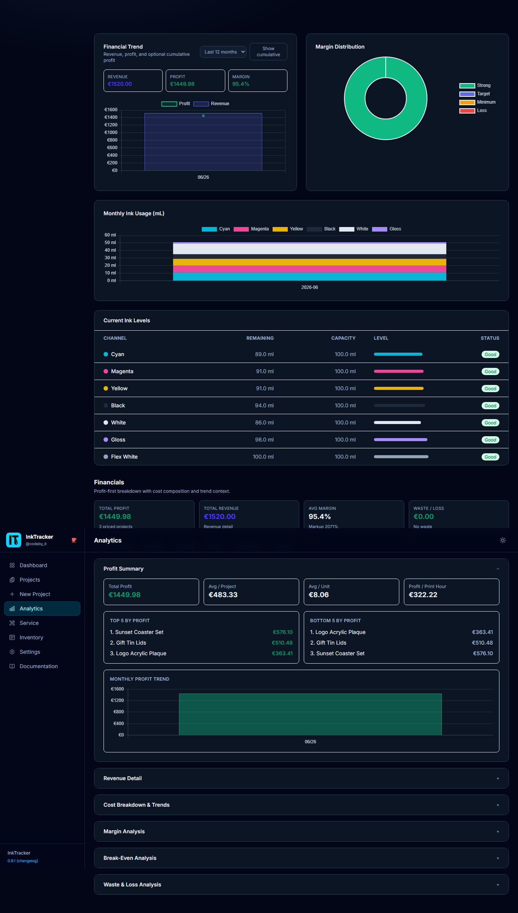

# 7. Analytics

The **Analytics** page turns your projects into easy-to-read charts so you can spot
trends, see what's profitable, and plan ink purchases.

---

## What the charts show

| Chart | What it tells you |
|---|---|
| **Revenue & profit over time** | How your earnings trend across weeks/months |
| **Margin distribution** | A doughnut showing how many jobs are Strong / Target / Minimum / Loss |
| **Monthly ink usage** | A stacked bar of ink used per color, month by month |
| **Ink level table** | Current remaining ink per channel |

## How to use it

- Watch the **margin doughnut** — a growing "Loss" slice means it's time to review
  pricing or costs in [Settings](08-settings.md).
- Use **monthly ink usage** to predict when to reorder cartridges.
- Compare **revenue vs. profit** to see if busy months are actually paying off.

💡 **Tip:** Charts update as you add and price projects, so check in weekly to catch
trends early.

---

Next: **[Settings →](08-settings.md)**
