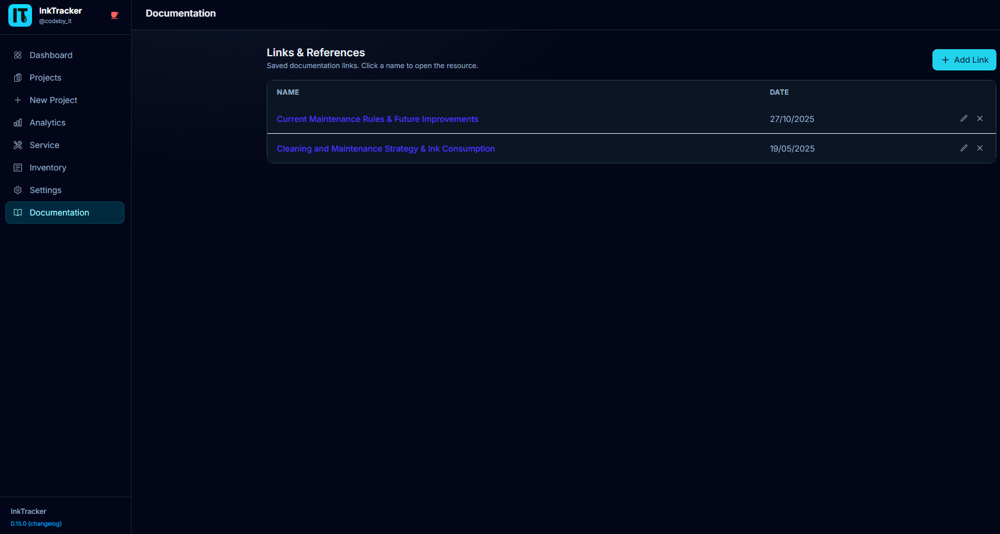
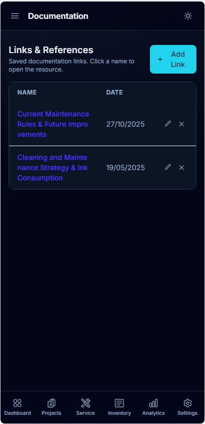

# 9. Documentation Links

The **Documentation** page is a handy place to keep links you reach for often —
supplier sheets, machine manuals, ink specs, or your own how-to notes. Everything lives
in one tidy list.

📱 On mobile

---

## Add a link
1. Open **Documentation** from the menu.
2. Click **Add**.
3. Enter a **name**, the **link (URL)**, and a **document date**.
4. Click **Save**.

The new reference appears in the list, ready to click.

## Edit or delete
- Click **Edit** on any row to update its name, link, or date.
- Click **Delete** to remove a reference you no longer need.

💡 **Tip:** Use the date field to know which version of a supplier sheet or manual a
link points to.

---

Next: **[Tips & FAQ →](10-tips-faq.md)**
