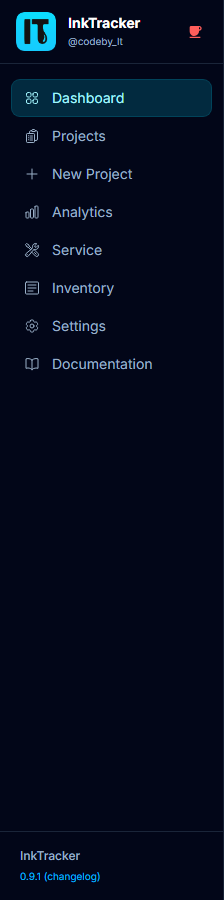

# InkTrack User Manual

Welcome! **InkTrack** helps you track ink, costs, maintenance, and profit for your
UV print studio — all in one place, with no monthly subscription. This manual is
written for everyday users: makers, studio operators, and shop owners. You don't need
any technical knowledge to follow along.

---

## How to use this manual

- Each guide covers **one part of the app** and walks you through it step by step.
- Buttons, menus, and fields you click are shown in **bold**.
- Look for 💡 **Tips** (helpful shortcuts) and ⚠️ **Notes** (things to watch out for).
- New here? Start with **Getting Started** — it takes about 5 minutes.

## Table of Contents

| # | Guide | What you'll learn |
|---|---|---|
| 1 | [Getting Started](01-getting-started.md) | Open the app, set it up, install it on your phone |
| 2 | [The Dashboard](02-dashboard.md) | Read your shop's health at a glance |
| 3 | [Creating a Project](03-new-project-wizard.md) | Price a job with the New Project wizard |
| 4 | [Managing Projects](04-projects.md) | Find, edit, duplicate, archive, and export jobs |
| 5 | [Service & Maintenance](05-service-maintenance.md) | Log cartridge swaps and upkeep |
| 6 | [Inventory](06-inventory.md) | Track materials and cartridge stock |
| 7 | [Analytics](07-analytics.md) | See revenue, margins, and ink trends |
| 8 | [Settings](08-settings.md) | Configure machine, ink, labor, and prices |
| 9 | [Documentation Links](09-documentation-links.md) | Keep handy references in one spot |
| 10 | [Tips & FAQ](10-tips-faq.md) | Printing, mobile use, glossary, common questions |

## Finding your way around

InkTrack has a menu down the left side on a computer, and a hamburger menu (☰) plus
a bottom tab bar on a phone. The main areas are: **Dashboard**, **Projects**,
**New Project**, **Analytics**, **Service**, **Inventory**, and **Settings**.

## Admin & install docs

Setting up or hosting InkTrack yourself? See the operator guides:

- [Installation](installation.md)
- [Configuration](configuration.md)
- [Upgrading](upgrading.md)
- [Troubleshooting](troubleshooting.md)

---

🆕 First time here? Jump to **[Getting Started →](01-getting-started.md)**
